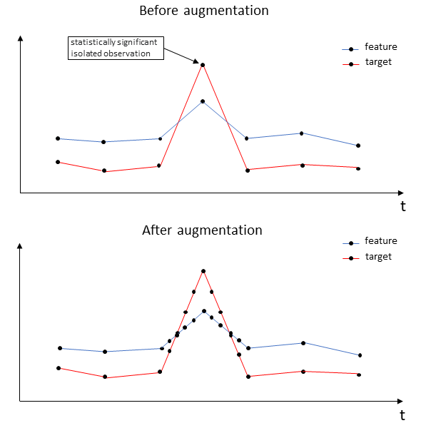
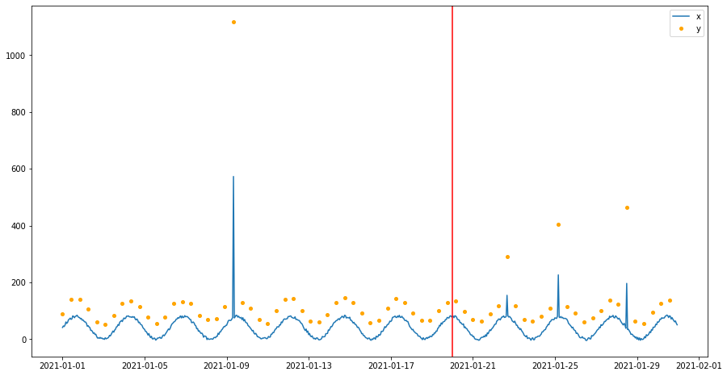
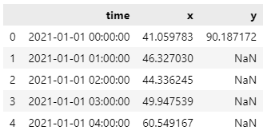
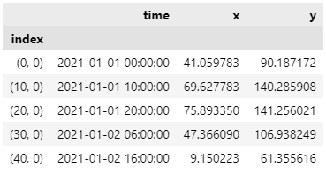
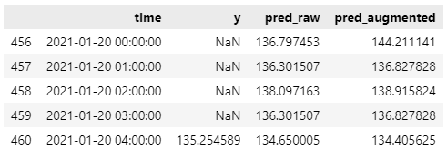
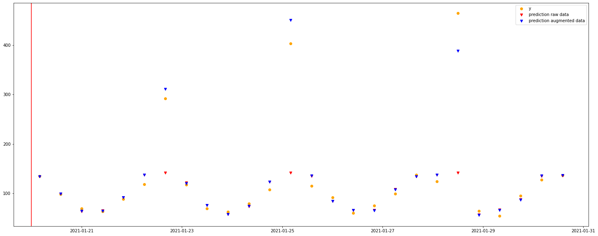

# Timeseries data augmentation

> Generation of additional measurements in time series regression reconstruction tasks

## Table of Contents

* [General Info](#general-information)

* [Setup](#setup)

* [Usage](#usage)

* [Acknowledgements](#acknowledgements)

* [License](#license)

* [Contacts](#autors)

## General Information

There are datasets with measurements which look like outliers and are relatively rare. Making predictions on such data, the quality of the prediction may not be sufficient, due to the small number of the above-mentioned measurements. This module solves this problem by augmentation. It creates additional measurement instances in the surroundings of measurements that look like outliers. In some cases, it improves the quality of prediction

The simplest explanation of our augmentation principle is shown in the picture below. This module adds instances in the neighbourhoods of the measurements which look like outliers.



More about this module is available in the article by link (in Russian): **[! insert the link !](http://)**

## Setup

```bash
git clone https://github.com/LeorFinkelberg/timeseries_data_augmentation.git
cd timeseries_data_augmentation/
conda create --name timeseries_data_augmentation python==3.8
conda activate timeseries_data_augmentation
pip install -r requirements.txt
```

## Usage

The main parameters of the augmentation class `TransformData` are:

- **N** - frequency or intensity of augmentation (i. e. the number of new augmented points for every sample).
- **K** - defines the threshold for comparing modified z-score estimations. The higher this threshold, the fewer neighbourhoods of statistically significant samples will be augmented.

Here is a **simple example** below. In this particular example we do:

- generate a DataFrame
- do augmentation by class `TransformData`
- compare SMAPE of augmented and row data.

### Import

```python
%load_ext autoreload
%autoreload 2
import sys, os
import pandas as pd
import numpy as np
import math
import matplotlib.pyplot as plt
from datetime import datetime, timedelta
from sklearn.ensemble import RandomForestRegressor

sys.path.insert(0, os.path.join("..", "src"))
from augmentation import TransformData

import warnings
warnings.filterwarnings("ignore")
```

### Data generating

```python
changes = {200: 8, 520: 2, 580: 3, 660: 5}

rnd_koeff = 10
ln = 24 * 30 * 1

np.random.seed(2021)
x = [
    (40 + 40 * math.sin(x / 10) + rnd_koeff * (np.random.rand() - 0.5))
    for x in range(ln)
]
np.random.seed(2022)
y = [
    (100 + 40 * math.sin(x / 10) + 2 * rnd_koeff * (np.random.rand() - 0.5))
    for x in range(ln)
]

for i in range(ln):
    if i % 10 != 0:
        y[i] = np.nan

for n, multy in changes.items():
    x[n] *= multy
    y[n] *= multy

dt = [datetime(2021, 1, 1) + timedelta(hours=x) for x in range(ln)]

df = pd.DataFrame({"time": dt, "x": x, "y": y})
train_test_split = datetime(2021, 1, 20)
```

### Let's look at the data

```python
plt.figure(figsize=(15, 8))
x_cols = list(set(df.columns) - set(["time", "y"]))
for col in x_cols:
    plt.plot(df.time, df[col], label=col)
plt.plot(df.time, df.y, "o", markersize=4, label="y", color="orange")
plt.axvline(train_test_split, color="red")
plt.legend();

df.head()
```





### Model

```python
model = RandomForestRegressor(n_estimators=200)
```

### DataFrame splitting into train and test

```python
train_df = df[(df.time < train_test_split) & (~np.isnan(df.y))]
test_df = df[df.time >= train_test_split]
```

### Do calculation with raw data only

```python
model.fit(train_df.drop(columns=["y", "time"]), train_df.y)
res_raw = model.predict(test_df.drop(columns=["y", "time"]))
```

### Do augmentation

```python
augmenter = TransformData(target_column="y", time_column="time", N=15, k=10)
augmented_data = augmenter.augment_data(train_df)
print(f"{len(augmented_data)} rows in raw dataset")
print(f"{len(train_df)} rows in augmented dataset")
augmented_data.head()
```

> 76 rows in raw dataset
> 
> 46 rows in augmented dataset



```python
model.fit(augmented_data.drop(columns=["y", "time"]), augmented_data.y)
res_augmented = model.predict(test_df.drop(columns=["y", "time"]))
```

### SMAPE metric estimation

```python
res = pd.DataFrame(
    {
        "time": test_df.time,
        "y": test_df.y,
        "pred_raw": res_raw,
        "pred_augmented": res_augmented,
    }
)
res.head()
```



```python
r = res[~np.isnan(res.y)]
def smape(a, f):
    return np.sum(np.abs(f - a)) / np.sum(f + a)

print("SMAPE for raw data:", smape(res.y, res.pred_raw))
print("SMAPE for augmented data:", smape(res.y, res.pred_augmented))
```

> SMAPE for raw data: 0.15119400641774933
> 
> SMAPE for augmented data: 0.04600873239210282

### Result visualization

```python
d = res[~np.isnan(res.y)]
plt.figure(figsize=(25, 10))
for col in d.columns:
    if col[0] == "x":
        plt.plot(d.time, d[col], label=col)
plt.plot(d.time, d.y, "o", markersize=6, label="y", color="orange")
plt.plot(d.time, d.pred_raw, "v", markersize=6, 
                          label="prediction raw data", color="red")
plt.plot(
    d.time,
    d.pred_augmented,
    "v",
    markersize=6,
    label="prediction augmented data",
    color="blue",
)
plt.axvline(train_test_split, color="red")
plt.legend()
plt.show();
```



## Acknowledgements

[1]  To compare the results of augmentation we used the [Tabular GAN](https://github.com/Diyago/GAN-for-tabular-data) library

## License

> GNU GENERAL PUBLIC LICENSE Version 3, 29 June 2007

## Authors

- Alexander Podvoyskiy: [@leorFinkelberg](https://github.com/leorFinkelberg/)
- Semen Kosyachenko:  [@piero10](https://github.com/piero10/)
- Alexander Kalinichenko: [@alex-kalinichenko](https://github.com/alex-kalinichenko)
